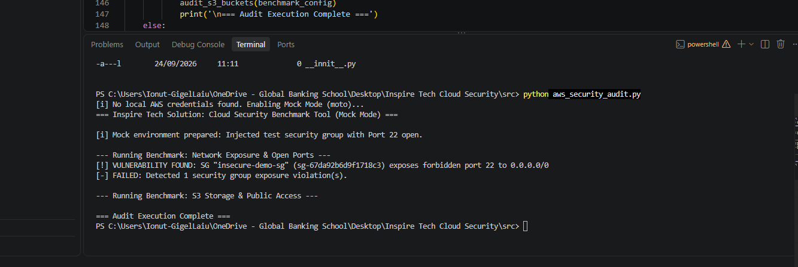
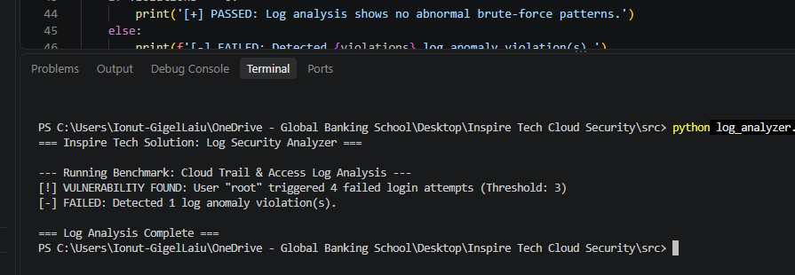
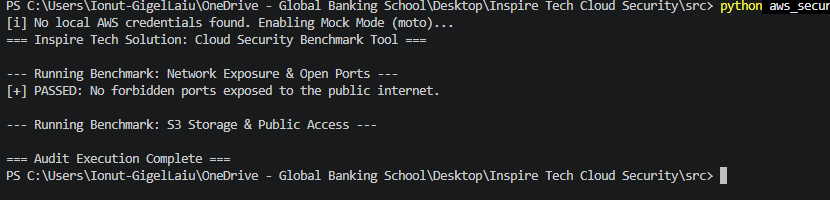

### Screenshots 

### Inspire Tech Solution: Automated Cloud Security Benchmark Tool

An automated, config-driven cloud security auditing toolkit built with Python, AWS (Boto3), and GitHub Actions. Designed to provide measurable, compliance-ready security assessments for infrastructure and log data.

Automated & Measurable: Instead of manual guessing, this toolkit executes concrete pass/fail security scans mapped directly to your defined benchmarks.

Config-Driven Architecture: Rules and thresholds are decoupled from the core source code via benchmarks.json, allowing security policies to be adjusted effortlessly without modifying application logic.

Continuous Integration Ready: Integrated directly into GitHub Actions to run automated checks on every code push or on a scheduled cron job.

Offline Mock Capabilities: Built with fallback support (moto) to simulate AWS environments locally for seamless development and live demonstrations without active cloud credentials.

Configuration (config/benchmarks.json)

### Getting Started & Running Locally

1. Prerequisites & Dependencies

Make sure you have Python installed, then install the required libraries:

pip install boto3 moto

2. Run the AWS Security Audit (Mock or Live Mode)

python src/aws_security_audit.py

Note: If no local AWS credentials are detected, the script automatically spins up an isolated mock environment via moto to demonstrate detection capabilities.

3. Run the CloudTrail / Log Security Analyzer

python src/log_analyzer.py

### GitHub Actions Automation

Our automated workflow (.github/workflows/security-scan.yml) handles continuous compliance checks:

Triggers on every push or pull_request to main/master.

Runs a scheduled daily scan
